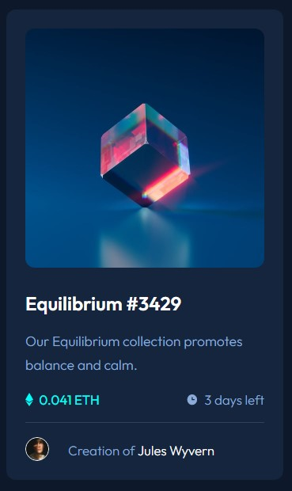

# Frontend Mentor - NFT component

This is a solution to the [NFT component challenge on Frontend Mentor](https://www.frontendmentor.io/challenges/nft-preview-card-component-SbdUL_w0U). Frontend Mentor challenges help you improve your coding skills by building realistic projects. 

## Table of contents

- [Overview](#overview)
  - [The challenge](#the-challenge)
  - [Screenshot](#screenshot)
  - [Links](#links)
- [My process](#my-process)
  - [Built with](#built-with)
  - [What I learned](#what-i-learned)
  - [Continued development](#continued-development)
  - [Useful resources](#useful-resources)
- [Author](#author)

## Overview

### The challenge

- Build out the project to the designs provided

### Screenshot

### Links

- Solution URL: [Frontend Mentor solution](https://www.frontendmentor.io/challenges/nft-preview-card-component-SbdUL_w0U/hub/nft-card-sass-8RvU_WzY4)
- Live Site URL: [Github pages](https://timmartin13-frontend-mentor.github.io/nft-preview-card-component/)

## My process

### Built with

- Semantic HTML5 markup
- Sass
- Flexbox
- Mobile-first workflow

### What I learned

I learned when to use em versus rem for fonts, padding, etc.  I also learned about using variables for various colors and sizes, and layering tags in Sass.

### Continued development

I want to keep focusing on Sass until I am comfortable with the syntax and rules of use.

### Useful resources

- [Sass Documentation](https://sass-lang.com/documentation/style-rules/declarations) - This helped me with the Sass syntax. I found it to be very useful.

## Author

- Website - [Portfolio](https://timmartin13.github.io/react-portfolio/)
- Frontend Mentor - [@TimMartin13](https://www.frontendmentor.io/profile/TimMartin13)
